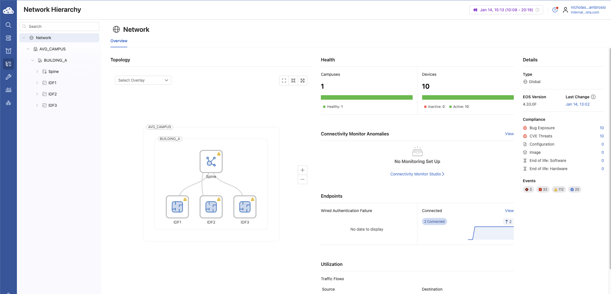
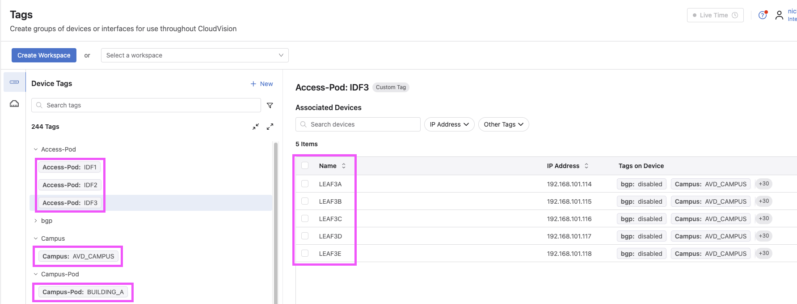

# AVD Generating CloudVision Campus Tags and Static Studios

This guide demonstrates how **Arista AVD** can automatically generate **CloudVision Campus Tags** and how those tags can be consumed by a **Static Configuration Studio** using a `config_manifest`.

This workflow enables a hybrid Campus operating model where:

- **AVD** builds and maintains the campus fabric and infrastructure
- **CloudVision Studios** are leveraged for topology visualization and day-2 operations

---

## High-Level Architecture


Figure 1 – Campus fabric topology generated and tagged by AVD

---

## Overview

The `arista.avd.eos_designs` role can generate **CloudVision Tags** that are applied to devices and interfaces during fabric deployment. These tags are used by CloudVision to:

- Render accurate **Campus Topology views**
- Enable **tag-based searches and filters**
- Dynamically place devices into **Studio container hierarchies**
- Support **hybrid AVD + Studios workflows**

This functionality is supported on:

- **CloudVision as a Service (CVaaS)**
- **On-prem CloudVision 2024.3.0 or later**

---

## Documentation References

- CloudVision Tags (AVD):  
  <https://avd.arista.com/5.7/ansible_collections/arista/avd/roles/eos_designs/docs/how-to/cloudvision-tags.html>

- Static Configuration Studio Deployment:  
  <https://avd.arista.com/5.7/ansible_collections/arista/avd/roles/cv_deploy/index.html#static-configuration-studio-deployment>

---

## Enabling CloudVision Tag Generation

To globally enable CloudVision tag generation for Campus fabrics, both of the following settings must be enabled:

```yaml
generate_cv_tags:
  topology_hints: true
  campus_fabric: true
```

These options allow AVD to generate the metadata required for:

- Campus topology rendering
- CloudVision Network Hierarchy UI activation
- Studio-based workflows

---

## CloudVision Network Hierarchy



Figure 2 – CloudVision Network Hierarchy UI activated by Campus tags

---

## Campus Tag Variables

AVD assigns CloudVision tags using fabric variables or node_type_keys.
The following variables are supported for Campus deployments:

| Variable                | Description                                       |
| ----------------------- | ------------------------------------------------- |
| `campus`                | Logical campus name                               |
| `campus_pod`            | Building or campus pod                            |
| `campus_access_pod`     | Access pod / IDF (not assigned to spines)         |
| `cv_tags_topology_type` | Campus node type (`spine`, `leaf`, `member-leaf`) |

---

## Example: Fabric Tag Assignment

L3 Spine Configuration

```yaml
l3spine:
  defaults:
    campus: AVD_CAMPUS
    campus_pod: BUILDING_A
  node_groups:
    - group: SPINES
      cv_tags_topology_type: spine
```

L2 Leaf Configuration

```yaml
l2leaf:
  defaults:
    campus: AVD_CAMPUS
    campus_pod: BUILDING_A
  node_groups:
    - group: IDF1
      cv_tags_topology_type: leaf
      campus_access_pod: IDF1
    - group: IDF2
      cv_tags_topology_type: leaf
      campus_access_pod: IDF2
    - group: IDF3
      cv_tags_topology_type: leaf
      campus_access_pod: IDF3
    - group: IDF3_3C
      cv_tags_topology_type: member-leaf
      campus_access_pod: IDF3
```

---

## CloudVision Tags Applied to Devices



Figure 3 – CloudVision device view showing AVD-generated Campus tags

---